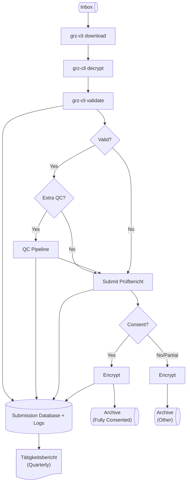
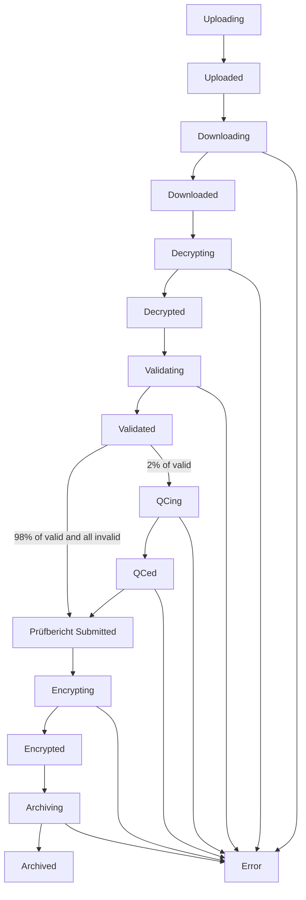

# Design of grz-watchdog

`grz-watchdog` should act as an automated data steward for the GRZ.
Most importantly, all steps that `grz-watchdog` manages should also be executable manually by a data steward to aid in debugging and error recovery.

## Pipeline Overview

## Submission Lifecycle

In case of any errors or explicit termination requests, `grz-watchdog` should be able to gracefully resume from any combination of submission states.
The major exception is any submission in an Error state (see lifecycle below), which would require manual intervention.

## Submission Database

Submissions are tracked within an SQLite database at each GRZ.

This database consists of three tables, described in the following sections.

### `submissions`

Columns:

1. `id` (primary key, str)
2. `tanG` (str | None)
    - after phase 0 this column must be null once a submission's test report has been successfully submitted.
    - need not be unique if, for example, there was a mistake in the first submission.
3. `pseudonym` (str | None)
    - during phase 0 this will be the local case ID
    - if tanG is null then we know that this is a real RKI psuedonym instead of a local case ID

### `submission_states`

Columns:

1. `submission_id` (primary key, str, maps to `id` in `submissions`)
2. `timestamp` (str, ISO 8601 format)
3. `state` (enum of lifecycle states)

### `submission_metrics`

Columns:

1. `submission_id` (primary key, str, maps to `id` in `submissions`)

QC metrics are in the following columns: TBD.

Need both metadata/LE-provided numbers and GRZ computed numbers.

## Pipeline Details

### `grz-cli download`

- perhaps a `--scan` or `--auto` flag to check all inboxes for submissions and their upload states and start downloading the oldest unprocessed one
  - submissions with a `metadata.json` are considered complete and ready for processing, as this is the last file `grz-cli upload` uploads
- prevent snakemake from filling up disk space by downloading lots of submissions while a few cores are free
  - idea: subworkflow for each submission with a disk resource that depends on the submission data size (QC pipeline takes up >4x input data size total disk space, including input data)

## Miscellaneous

- Decide on sampling logic for ensuring >=2% and >=1/month of submissions are QCed
- Decide on retry logic for test report API
- Can use [Florian's tool](https://github.com/Hoeze/snakemk_util) to test snakemake rules outside of a workflow
- verify submission ID on our side since it is deterministic
