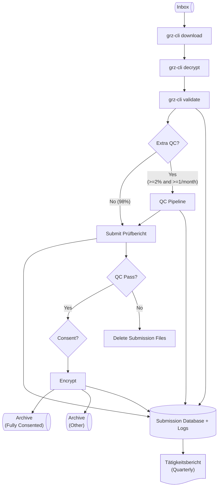
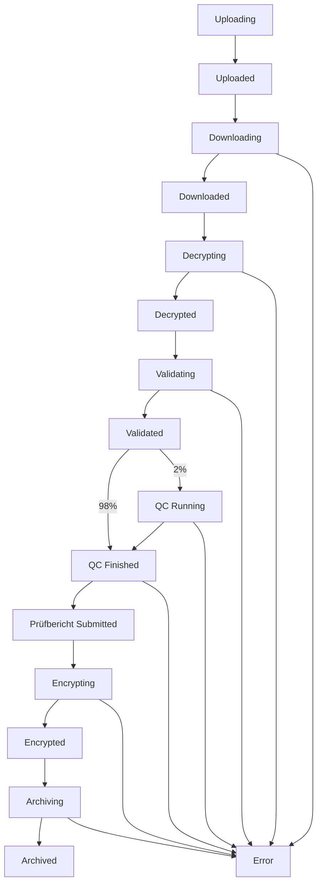

# Design of grz-watchdog

## Pipeline Overview

## Submission Lifecycle

## Submission Database

Submissions are tracked within an SQLite database at each GRZ.

This database consists of three tables, described in the following sections.

### `submissions`

Columns:

1. `id` (primary key, str)
2. `tanG` (str | None)
    - after phase 0 this column must be null once a submission's test report has been successfully submitted.
    - need not be unique if, for example, there was a mistake in the first submission.
3. `pseudonym` (str | None)

### `submission_states`

Columns:

1. `submission_id` (primary key, str, maps to `id` in `submissions`)
2. `timestamp` (str, ISO 8601 format)
3. `state` (enum of lifecycle states)

### `submission_metrics`

Columns:

1. `submission_id` (primary key, str, maps to `id` in `submissions`)

QC metrics are in the following columns: TBD.

Need both metadata/LE-provided numbers and GRZ computed numbers.

